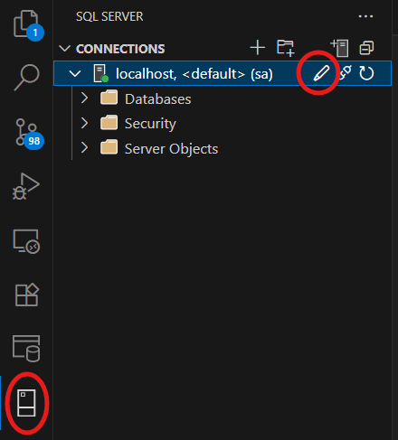

# CPSC 441 - Database

## Codespaces/Dev Container

Open this repository with a GitHub Codespace or locally with a dev container. A SQL Server container will be created and started.

After creation, all scripts in `scripts/sql-server` will be executed, populating the server with numerous sample databases.

### Connecting to the SQL Server

You can use the SQL Server VS Code extension to connect to the server within the container.



If you want to connect to the SQL Server using a separate client (e.g., Datagrip), you'll need to open the Codespace in VS Code (or use a local dev container).

Then you can connect with a separate SQL client using localhost and port 1433.

## Running a SQL Server using Docker

If you don't want to use GitHub Codespaces or a local dev container, you can host a SQL Server locally using Docker.

### Option 1: Use `docker compose`

- Install Docker Desktop.
- Navigate to the directory [sql-server-docker](./sql-server-docker/) in a terminal window.
- Execute `docker compose up -d`.

### Option 2: Use `docker run`

Docker Compose is the preferred way, but you can create the container directly with the following command:

```
docker run -e "ACCEPT_EULA=Y" -e "MSSQL_SA_PASSWORD=yourStrong(!)Password" -p 1433:1433 -d mcr.microsoft.com/mssql/server:2022-latest
```

### Connecting to the server

When connecting to server:

- User: `SA`
- Password: `yourStrong(!)Password`
